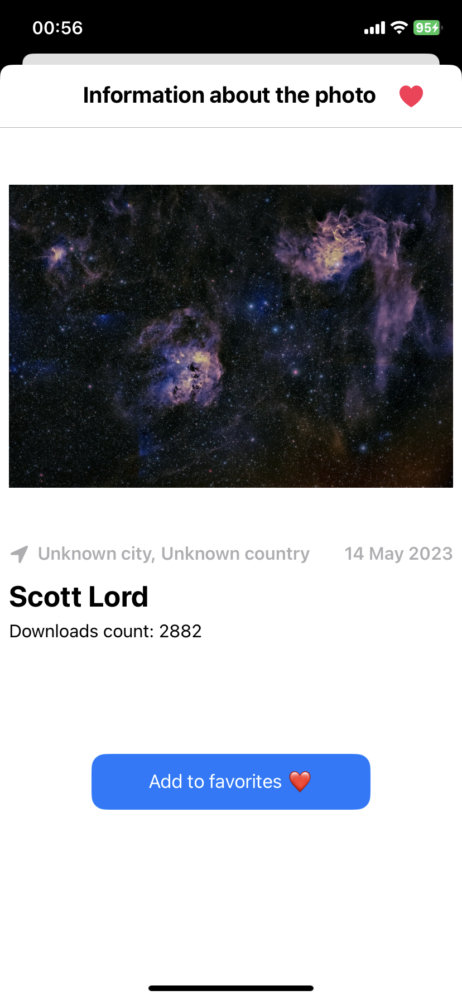

# White-FluffyTestApp

## Это тестовое приложение с использованием Unsplash [API](https://unsplash.com/documentation) от компании White And Fluffy. [Website](https://whiteandfluffyteam.com)

### Описание приложения:
1) Стартовый экран — таббар с двумя вкладками: 
- На первой вкладке — коллекция случайных фотографий с Unsplash. Вверху строка поиска по фотографиям с Unsplash. При нажатии на ячейку пользователь попадает на экран подробной информации;
- На второй вкладке — таблица со списком любимых фотографий,в ячейке миниатюрка фотографии и имя автора. При нажатии на ячейку — переход в экран подробной информации.

2) Экран подробной информации содержит в себе:
- фотографию;
- имя автора;
- дату создания;
- местоположение;
- количество скачиваний.
Также экран содержит кнопку, нажатие на которую может добавить фотографию в список любимых фотографий и удалить из него.

  
  
  

